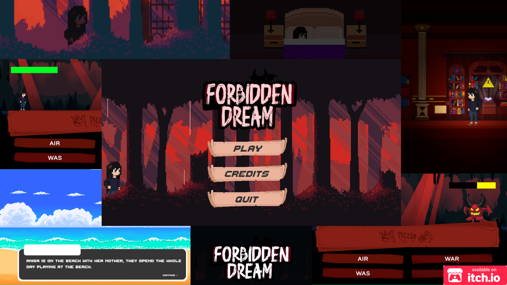

  

## About
Forbidden Dreams is a serious game created with the theme of special needs using SIBI sign language with a combination of role playing, 
puzzles and a little horror element. The game follows the story of a girl named Anisa who is trapped in a dream world. There he met a ghost named 'A' who would guide him to get out of the dream world. 
Anisa's journey will certainly not be easy, she has to solve several cases, where to solve them, Anisa has to use SIBI sign language. That way, he can be free from the dream world.

## 🎯Gameplay
Follow the story of Anisa in the dream world and find out how she escape. Using SIBI sign language as her guide, player need to configure the way to escape by completing various quest and defeating enemies.

## 🕹️Controls
- AD or Left/Right Arrow Keys to move.
- Space to jump.
- H to open the SIBI sign language guide book.
- F to interact and go upstairs.
- E to go downstairs.
- G to grab item.
- Left Click to attack.
*Player can check the control manual when reaching the mansion chapter by clicking the book icon in the top right corner.

## Download Game
Link : https://xtremehyper.itch.io/forbidden-dreams

## Developer
Vincent Tanujaya - Game Programmer & Artist

I GDE Wahyu Werayana - Game Programmer & Artist

Aaron Medhavi Kusnandar - Story Writer

Nicholas Diperedjo - Sound Engineer

## Asset
Special Thanks to 
Mattz Art, Humble Pixel, GandalfHardcore, Chasersgaming, MedievalMore, Aethrall, Crusenho

